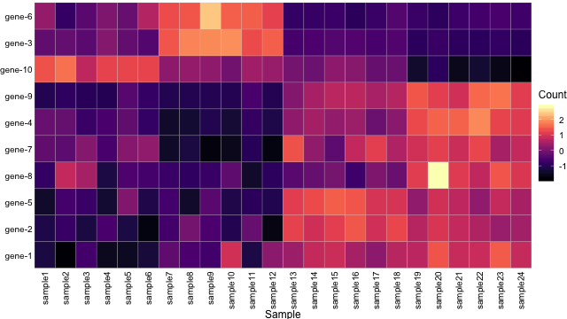
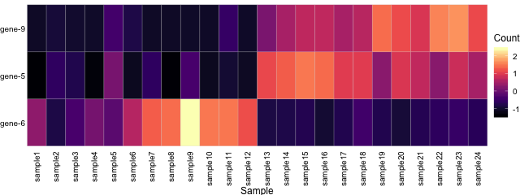
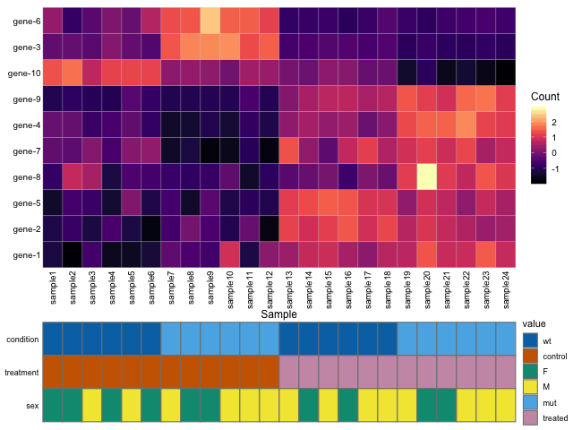
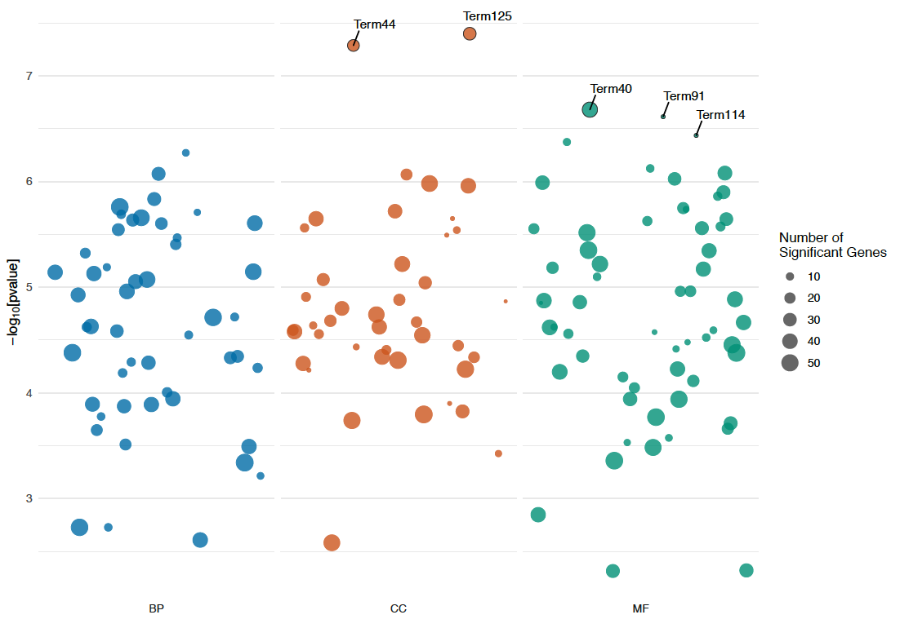
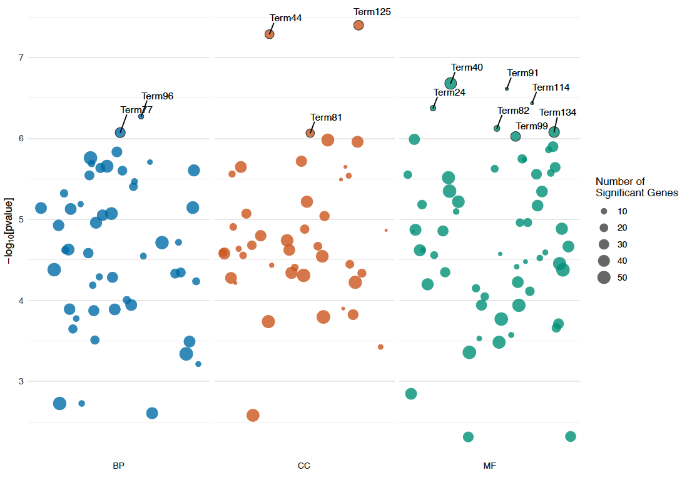
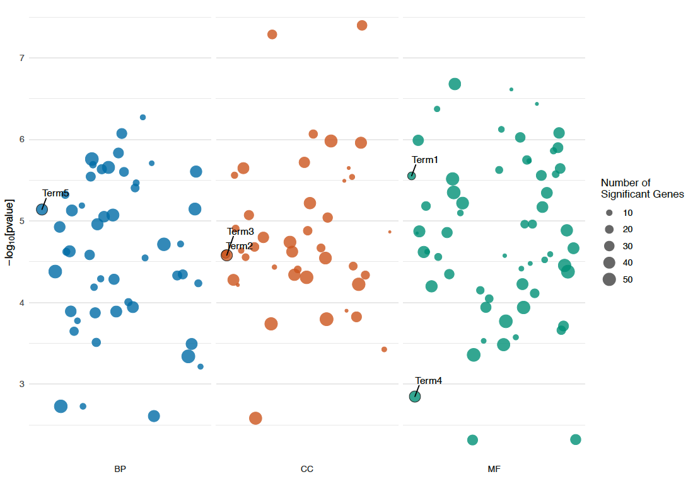
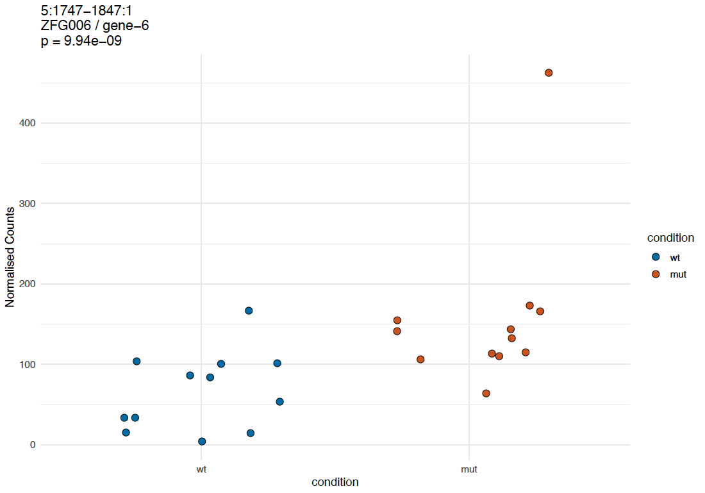
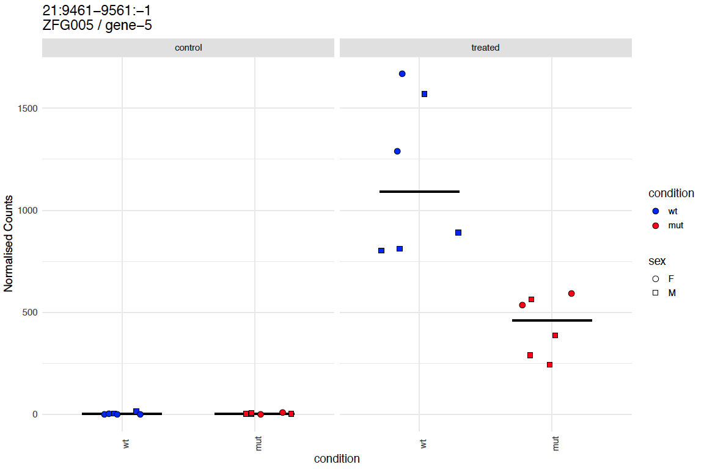

# bioinf-gen

General Bioinformatics scripts

## Scripts

* aggregate_zfa.R - aggregate ZFA terms by another column
* cluster_samples_rnaseq.R
* convert_detct_to_rnaseq_for_gsea.pl
* create_geneset_file.R
* create_rnaseq_rds.R
* deseq2-multiple_groups.R
* [gene_expr_heatmap.R](https://github.com/richysix/bioinf-gen#gene_expr_heatmapr) - Gene expression heatmap
* gene_lists_from_groups_cluego.pl
* get_msigdb_geneset.R
* [go_bubble_plot.R](https://github.com/richysix/bioinf-gen#go_bubble_plotr) - Produce a bubble plot from a topgo analysis
* [graph_counts_by_group_facet.R](https://github.com/richysix/bioinf-gen#graph_counts_by_group_facetr) - jittered and facetted count plot
* graph_counts_line.R
* histogram.R
* matrix_heatmap_plot.R
* merge_deseq_counts.pl - merge deseq counts from mutliple files
* mutmap_create_tsv.pl
* reshape-long_to_wide.R - reshapes long data to wide data
* [run_cluego.R](https://github.com/richysix/bioinf-gen#run_cluegor) - Run a Cytoscape ClueGO analysis from gene list(s)
* volcano_plot.R
* xlsx_conditional_formatting.R

### gene_expr_heatmap.R

Script to produce a heatmap from RNAseq data. It expects a sample file and a count file (e.g. sig.tsv)
and the name of the output image file.

There is an example samples file and sig file in the test_data directory of this repository.
For example
```
../gene_expr_heatmap.R --transform rlog \
--center_and_scale --cluster rows \
--colour_palette magma --cell_colour grey80 \
--gene_names --sample_names \
test_samples.tsv test_rnaseq_data.tsv test_heatmap.pdf
```

The available fill_palettes are those from [viridis](https://cran.r-project.org/web/packages/viridis/vignettes/intro-to-viridis.html) and
[ColorBrewer](https://colorbrewer2.org/) via [scale_fill_distiller](https://ggplot2.tidyverse.org/reference/scale_brewer.html)



It is also possible to supply a list of gene ids to subset the heatmap to.

```
# create a test ids file
echo -e "ZFG005\nZFG006\nZFG009" > test_genes.txt

../gene_expr_heatmap.R --transform rlog \
--center_and_scale --cluster rows \
--colour_palette magma --cell_colour grey80 \
--gene_names --sample_names \
--genes_file test_genes.txt \
--width 7 --height 2.5 \
test_samples.tsv test_rnaseq_data.tsv test_heatmap_subset.pdf
```



A file of sample metadata can also be supplied and will be plotted as a heatmap
under the expression heatmap.
```
../gene_expr_heatmap.R --transform rlog \
--center_and_scale --cluster rows \
--colour_palette magma --cell_colour grey80 \
--gene_names --sample_names \
--metadata_file test_samples_long.tsv \
--metadata_ycol category \
--metadata_fill value \
--relative_plot_sizes 9,2 \
test_samples.tsv test_rnaseq_data.tsv test_heatmap_with_metadata.pdf
```



### go_bubble_plot.R

Script to produce a bubble plot using the output from Ian's topgo script.
It expects files called "BP.sig.tsv", "CC.sig.tsv" and "MF.sig.tsv" in the
working directory.

There is some test toy GO data in the test_data directory of this repository.
For example, run the script with defaults
```
cd test_data
../go_bubble_plot.R
```
This will produce a bubble plot (go_bubble.pdf) with the top 5 terms by pvalue labelled.



To set a p value cut off for labelling
```
../go_bubble_plot.R --label_p_cutoff 1e-6
```



Or to label specific terms. The GO IDs are used to specify which terms to label,
but the actual term descriptions are used as the labels.
```
../go_bubble_plot.R \
--labels="GO:0000001,GO:0000002,GO:0000003,GO:0000004,GO:0000005"
```



--no_labels will remove labels altogether
```
../go_bubble_plot.R --no_labels
```

**Required packages**
* [tidyverse](https://www.tidyverse.org/)
* [viridis](https://cran.r-project.org/web/packages/viridis/vignettes/intro-to-viridis.html)
* [ggrepel](https://cran.r-project.org/web/packages/ggrepel/vignettes/ggrepel.html)
* [biovisr](https://github.com/richysix/biovisr)
* [miscr](https://github.com/richysix/miscr)

### graph_counts_by_group_facet.R

This is a script to produce counts plots from RNA-seq (or DETCT) data.
The required arguments are a samples file and a sig file.
It expects the sample file to have a header with the column names.
It expects one of the columns to be called "sample".
e.g.
```
sample  condition
sample_1    wt
sample_2    mut
```

There is an example samples file and sig file in the test_data directory of
this repository.
The simplest way to run the script would be this:
```
cd test_data
../graph_counts_by_group_facet.R \
test_samples.tsv test_rnaseq_data.tsv
```



By default it tries to use a column named condition in the samples file as the
x variable. The default is to colour the points by condition as well.

The --x_variable option allows you to name a column to use as the x axis and
you can also specify columns to use for colours (--colour_variable) and
shapes (--shape_variable).
The --crossbar option plots a bar to show the mean/median of each group.
It is also possible to supply a file of Ensembl gene ids and the script will
only make plots for those gene ids in the data.

The example below uses almost all the available options
```
# create a test ids file
echo -e "ZFG005\nZFG006\nZFG009" > test_genes.txt

../graph_counts_by_group_facet.R \
--output_file test-condition-sex-treatment.pdf \
--genes_file test_genes.txt \
--x_variable condition \
--colour_variable condition \
--colour_palette wt=#0000ff,mut=#ff0000 \
--shape_variable sex \
--facet_variable treatment \
--crossbar median \
--width 12 \
--height 8 \
--theme_base_size 14 \
--rotate_xaxis_labels \
--seed 7635 \
--no_pvalue \
test_samples.tsv test_rnaseq_data.tsv
```



The other options are:
* --no_jitter - removes the jitter from the points
* --detct - input data is DeTCT rather than RNAseq

**Required packages**
* [tidyverse](https://www.tidyverse.org/)
* [biovisr](https://github.com/richysix/biovisr)
* [rnaseqtools](https://github.com/richysix/rnaseqtools)

### run_cluego.R

This script runs a standard ClueGO analysis from the supplied gene lists. It assumes that the gene list
has no header and is Ensembl gene ids in the first column. If more than one gene list is supplied,
the script will produce two images, one coloured by group (Enriched Term) and one coloured by cluster (Gene List origin).
At the moment the script runs the analysis and saves an image(s) and the output files, but I
can't find a way to save the analysis as a ClueGO session. This must be done manually in Cytoscape.

Cytoscape (>v3.6+) must be open and Cytoscape Apps 'yFiles Layout Algorithms' and 'ClueGO' must be installed.

*Example*
```
# Run with 1 gene list
run_cluego.R --verbose --analysis_name groups \
--output_image_file=cluego-groups.svg \
--output_basename=cluego-groups \
set1.sig.genes

# Run with 2 gene lists to see the overlap
run_cluego.R --verbose --analysis_name overlaps \
--output_image_file=overlap-cluego.svg \
--output_basename=overlap-cluego \
set1.sig.genes set2.sig.genes
```

I've had problems trying to run multiple analyses in sequence. If that happens you can try adding the `--destroy_network` option. 
That will destroy the network at the end of the script so you won't be able to save it as a ClueGO/Cytoscape network, but it means that you can produce a bunch of network pictures in one go.

**Required packages**
* [xml2](https://github.com/r-lib/xml2)
* [RJSONIO](https://cran.r-project.org/web/packages/RJSONIO/index.html)
* [httr](https://github.com/r-lib/httr)
* [biovisr](https://github.com/richysix/biovisr)
