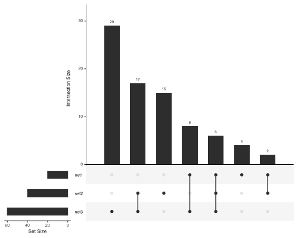
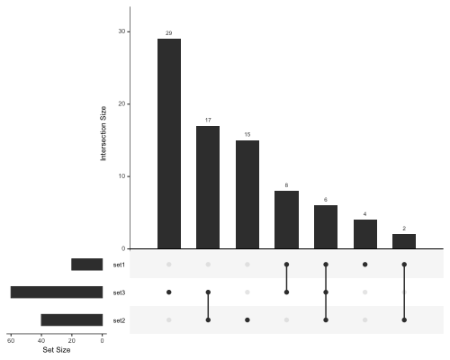

# bioinf-gen

General Bioinformatics scripts

## Scripts

Click on the links to go to the documentation for that script.

* aggregate_zfa.R - aggregate ZFA terms by another column
* [bubble_plot.R](docs/bubble_plot/bubble_plot.md) - Generic bubble plot
* cluster_samples_rnaseq.R
* convert_detct_to_rnaseq_for_gsea.pl
* create_geneset_file.R
* create_rnaseq_rds.R
* deseq2-multiple_groups.R
* [gene_expr_heatmap.R](docs/gene_expr_heatmap/gene_expr_heatmap.md) - Gene expression heatmap
* gene_lists_from_groups_cluego.pl
* get_msigdb_geneset.R
* [go_barchart.R](https://github.com/richysix/bioinf-gen#go_barchartr) - Produce a bar chart of GO results
* [go_bubble_plot.R](docs/go_bubble_plot/go_bubble_plot.md) - Produce a bubble plot from a topgo analysis
* [graph_counts_by_group_facet.R](docs/graph_counts_by_group_facet/graph_counts_by_group_facet.md) - jittered and facetted count plot
* graph_counts_line.R
* gsea_to_genes.py - Get the genes behind GSEA enrichments
* histogram.R
* matrix_heatmap_plot.R
* merge_deseq_counts.pl - merge deseq counts from mutliple files
* mutmap_create_tsv.pl
* reshape-long_to_wide.R - reshapes long data to wide data
* [run_cluego.R](https://github.com/richysix/bioinf-gen#run_cluegor) - Run a Cytoscape ClueGO analysis from gene list(s)
* [upset-sig-genes.R](https://github.com/richysix/bioinf-gen#upset-sig-genesr) - Simple UpSet plot from DESeq2 sig files with genes for each intersection
* [volcano_plot.R](docs/volcano_plot/volcano_plot.md) - Volcano plot
* xlsx_conditional_formatting.R

The plot scripts (gene_expr_heatmap.R, go_barchart.R, go_bubble_plot.R etc.) support outputting plot files as
pdf, png, ps and svg

### go_barchart.R

Script to produce a barchart from a file of GO enrichments. By default the
script expects columns named GO.ID, Term, FE, Set and up_down, but these can be
changed by setting options. The GO.IDs are plotted on the y axis and the
horizontal bars represent the Fold Enrichment (FE). The bars are coloured by
Set and depending os up_down are plotted to the left or right.

There is an example file in the test_data directory of this repository.

```
cd test_data
../go_barchart.R test_data_go.tsv
```


The column to use can be changed with the `--x_variable` option. In this
example only the top 20 terms (by the x variable) are plotted.
```
../go_barchart.R --x_variable log10p --x_axis_title="-log10[pvalue]" \
--fill_variable Set --top_terms 20 \
--output_file go_barchart_top20.svg \
test_data_go.tsv
```


**Required packages**
* [tidyverse](https://www.tidyverse.org/)
* [grid](https://www.tidyverse.org/)
* [biovisr](https://github.com/richysix/biovisr)
* [miscr](https://github.com/richysix/miscr)

### gsea_to_genes.py

This is a script to take GSEA output files and return the genes that are
responsible for each enrichment.
There are test file in the test_data directory of this repository.
```
cd test_data
../gsea_to_genes.py --comparison test test_gsea_report.xls
```
Each line has the supplied comparison so that multiple of these output files
can be concatenated.
The `--genes_file` option allows the output to be limited to only genes in the
supplied list (e.g. sig genes).
```
../gsea_to_genes.py --genes_file gsea-genes.txt --comparison test test_gsea_report.xls
```
The default is to output to STDOUT, but an output filename can be given after
the input file name

### run_cluego.R

This script runs a standard ClueGO analysis from the supplied gene lists. It assumes that the gene list
has no header and is Ensembl gene ids in the first column. If more than one gene list is supplied,
the script will produce two images, one coloured by group (Enriched Term) and one coloured by cluster (Gene List origin).
At the moment the script runs the analysis and saves an image(s) and the output files, but I
can't find a way to save the analysis as a ClueGO session. This must be done manually in Cytoscape.

Cytoscape (>v3.6+) must be open and Cytoscape Apps 'yFiles Layout Algorithms' and 'ClueGO' must be installed.

*Example*
```
# Run with 1 gene list
run_cluego.R --verbose --analysis_name groups \
--output_image_file=cluego-groups.svg \
--output_basename=cluego-groups \
set1.sig.genes

# Run with 2 gene lists to see the overlap
run_cluego.R --verbose --analysis_name overlaps \
--output_image_file=overlap-cluego.svg \
--output_basename=overlap-cluego \
set1.sig.genes set2.sig.genes
```

I've had problems trying to run multiple analyses in sequence. If that happens you can try adding the `--destroy_network` option. 
That will destroy the network at the end of the script so you won't be able to save it as a ClueGO/Cytoscape network, but it means that you can produce a bunch of network pictures in one go.

**Required packages**
* [tidyverse](https://www.tidyverse.org/)
* [xml2](https://github.com/r-lib/xml2)
* [RJSONIO](https://cran.r-project.org/web/packages/RJSONIO/index.html)
* [httr](https://github.com/r-lib/httr)
* [biovisr](https://github.com/richysix/biovisr)

### upset-sig-genes.R

This script produces a basic UpSet plot from a list of DESeq2 sig files.

```
Rscript ../upset-sig-genes.R \
--plot_file upset-plot-test.pdf \
--output_file upset-plot-test-out.tsv \
set1.sig.tsv set2.sig.tsv set3.sig.tsv
```



The script names the sets by removing deseq2- from the start and [./]sig.tsv from the end of the filenames.
It also outputs a file of which genes are in which intersections.
The intersections are numbered by converting the binary representation of which sets are included into a decimal.
For example, if there are 3 sets (set1, set2 and set3), the intersection numbered 5 represents the elements in both set 1 and set3, but not set2
```
set1 set2 set3
 1    0    1   = 5
```

The sets are order by size, which means they may appear in a different order to the command and this includes the naming of the intersections.
If you wish to keep the sets in the same order as that of the command set --keep_order option. In this case, the sets will also be in this order in the UpSet plot.

```
Rscript ../upset-sig-genes.R \
--plot_file upset-plot-test-ordered.pdf \
--output_file upset-plot-test-ordered-out.tsv \
--keep_order \
set2.sig.tsv set3.sig.tsv set1.sig.tsv
```




