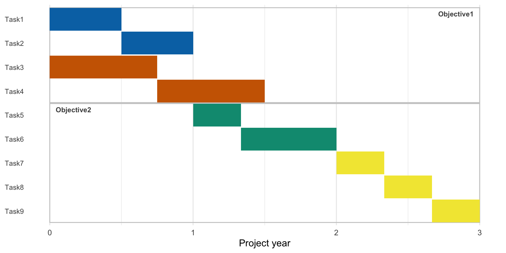
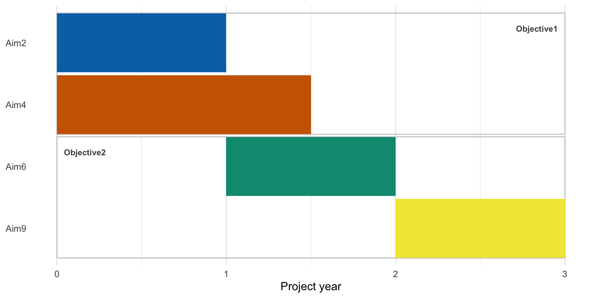

# Create a Gantt chart from an Excel spreadsheet.

[Go to script](../../gantt-from-excel.R)

Script to produce a Gantt chart from an Excel worksheet. There is some
test data in the test_data directory of this repository.  
The script expects columns named `TaskID`, `Task`, `CategoryID`,
`Category`, `Start` and `TimeEstimate`. `SuperCategory` is an optional
column used to group items to have a box drawn around them. The script
produces two plots. One contains each task on a separate line and the
bars are coloured by category. The second aggregates the data to
categories. For example …

``` bash
Rscript gantt-from-excel.R \
test_data/gantt-test-data.xlsx
```

By default, both plots are output to a pdf called `gantt.pdf`. Separate
plots can be produced in `png`, `svg` or `eps` format. Extra options
include –output_file to change the name of the output file –sheet_name
to set the name of the sheet to use –width and –height to set the
dimensions of the plots –add_super_category_boxes to have boxes drawn
around the bars to groups categories into larger categories

``` bash
Rscript gantt-from-excel.R \
--output_file gantt-test.png \
--sheet_name "gantt-table" \
--width 1600 --height 800 \
--add_super_category_boxes \
test_data/gantt-test-data.xlsx
```

<figure>

<figcaption aria-hidden="true">Test Gantt chart by task. It shows
coloured bars, representing the start and estimated durations of a set
of tasks.</figcaption>
</figure>

<figure>

<figcaption aria-hidden="true">Test Gantt chart by category. It shows
coloured bars, representing the start and estimated durations of a set
of tasks aggregated to the task categories.</figcaption>
</figure>
