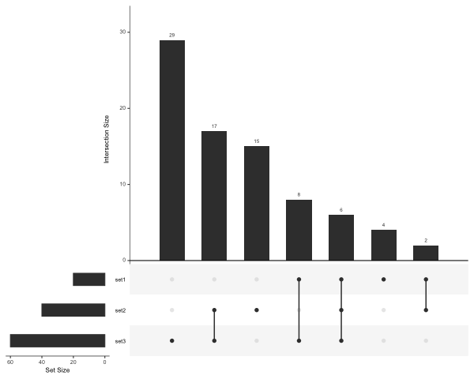
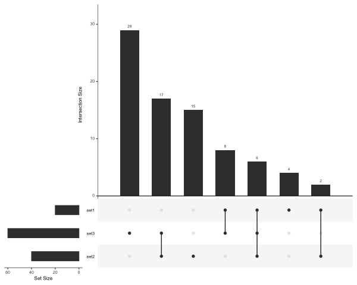

```{r packages, include=FALSE, message=FALSE}
for (package in c("knitr", "rprojroot", "tidyverse")) {
  library(package, character.only = TRUE)
}
```

```{r knitr_options, include=FALSE, message=FALSE}
opts_chunk$set(include = TRUE, echo = TRUE)
```

```{r root-path, include=FALSE}
root_path <- find_root(is_rstudio_project)
Sys.setenv(ROOT_PATH = root_path)
```

```{r create-test-data, include=FALSE}
# make test data for upset-sig-genes.R
num_genes <- 100
genes <- sprintf('ENSTEST%03d', seq_len(num_genes))
names(genes) <- paste0('gene-', seq_len(num_genes))
set.seed(9374)
sets <- purrr::map(1:3, function(num){
  num_rows <- 20*num
  starts <- sample(1:10000, num_rows)
  gene_subset <- sample(genes, num_rows)
  tibble(
    'GeneID' = gene_subset,
    'chr' = sample(1:25, num_rows, replace = TRUE),
    'start' = starts,
    'end' = as.integer(starts + 100),
    'strand' = sample(c('1', '-1'), num_rows, replace = TRUE),
    'p value' = runif(num_rows, min = 1e-8, max = 0.001),
    'Adjusted p value' = `p value` * 20,
    'Gene name' = names(gene_subset)
  )
})
output_test_data <- function(x, sets) {
  filename <- file.path(root_path, 'test_data', paste0('set', x, '.sig.tsv'))
  write_tsv(sets[[x]], file = filename)
}
purrr::walk(1:3, output_test_data, sets) |> 
  invisible()
```

## upset-sig-genes.R

[Go to script](../../run_cluego.R)

This script produces a basic UpSet plot from a list of DESeq2 sig files. For example:

```{bash upset, eval=FALSE, echo=TRUE}
cd test_data
Rscript ../upset-sig-genes.R \
--plot_file upset-plot-test.pdf \
--output_file upset-plot-test-out.tsv \
set1.sig.tsv set2.sig.tsv set3.sig.tsv
```

```{bash run-upset, echo=FALSE, results='hide'}
Rscript $ROOT_PATH/upset-sig-genes.R \
--plot_file upset-plot-test.png \
--width 600 --height 480 \
--output_file upset-plot-test-out.tsv \
$ROOT_PATH/test_data/set1.sig.tsv \
$ROOT_PATH/test_data/set2.sig.tsv \
$ROOT_PATH/test_data/set3.sig.tsv
```



The script tries to automatically label the set using the file names.
If the files are name 'sig.tsv' and in separate directories, the directory
name is used (after removing deseq2- from the beginning if it is there).
Otherwise if the files are named *.sig.tsv, then .sig.tsv is removed from the 
end and the remainder is used as the set labels.

For example, inputs files named 

deseq2-hom-vs-wt/sig.tsv  
deseq2-hom-vs-het/sig.tsv  
deseq2-het-vs-wt/sig.tsv  

will be labelled hom-vs-wt, hom-vs-het and het-vs-wt

And files named

deseq2/hom-vs-wt.sig.tsv  
deseq2/hom-vs-het.sig.tsv  
deseq2/het-vs-wt.sig.tsv  

will also be labelled hom-vs-wt, hom-vs-het and het-vs-wt

It also outputs a file of which genes are in which intersections.
The intersections are numbered by converting the binary representation of 
which sets are included into a decimal.
For example, if there are 3 sets (set1, set2 and set3), the intersection 
numbered 5 represents the elements in both set 1 and set3, but not set2
```
set1 set2 set3
 1    0    1   = 5
```

The sets are order by size, which means they may appear in a different order 
to the command and this includes the naming of the intersections.
If you wish to keep the sets in the same order as that of the command set the
`--keep_order` option. In this case, the sets will also be in this order in the UpSet plot,
with the first set at the bottom of the y-axis.

```{bash upset-keep-order, eval=FALSE, echo=TRUE}
Rscript ../upset-sig-genes.R \
--plot_file upset-plot-test-ordered.pdf \
--output_file upset-plot-test-ordered-out.tsv \
--keep_order \
set2.sig.tsv set3.sig.tsv set1.sig.tsv
```

```{bash run-upset-keep-order, echo=FALSE, results='hide'}
Rscript $ROOT_PATH/upset-sig-genes.R \
--plot_file upset-plot-test-ordered.png \
--width 600 --height 480 \
--output_file upset-plot-test-ordered-out.tsv \
--keep_order \
$ROOT_PATH/test_data/set2.sig.tsv \
$ROOT_PATH/test_data/set3.sig.tsv \
$ROOT_PATH/test_data/set1.sig.tsv
```


