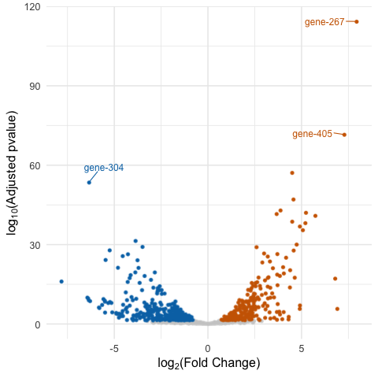
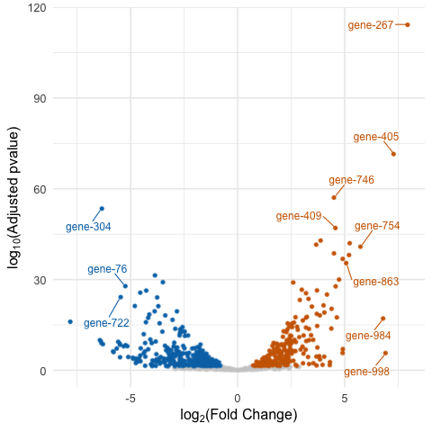

## volcano_plot.R

```{r packages, include=FALSE, message=FALSE}
for( package in c("knitr", "rprojroot", "DESeq2", "tidyverse")) {
  library(package, character.only = TRUE)
}
```

```{r knitr_options, include=FALSE, message=FALSE}
opts_chunk$set(include=TRUE, echo=TRUE)
```

```{r root-path, include=FALSE}
root_path <- find_root(is_rstudio_project)
Sys.setenv(ROOT_PATH = root_path)
```

```{r create-test-data, include=FALSE}
set.seed(583)
dds <- makeExampleDESeqDataSet(n = 1000, m = 12, betaSD = 2)
dds <- DESeq(dds)
res <- results(dds)
num_rows <- nrow(dds)
set.seed(846)
starts <- sample(1:10000, num_rows)
test_all_data <- tibble(
  'GeneID' = sprintf('ENSTEST%03d', seq_len(num_rows)),
  'p value' = res$pvalue,
  'adjp' = res$padj,
  'log2fc' = res$log2FoldChange,
  'Name' = paste0('gene-', seq_len(num_rows))
)
write_tsv(test_all_data, path = file.path(root_path, 'test_data', 'test_data_volcano.tsv'))
```

[Go to script](../../volcano_plot.R)

Script to produce a volcano plot from a RNA-seq experiment.  
It expects columns named `adjp` and `log2fc` in the input file. 

```{bash volcano-basic, eval=FALSE, echo=TRUE}
Rscript volcano_plot.R \
test_data/test_data_volcano.tsv \
volcano-basic.pdf
```

```{bash run-volcano-basic, echo=FALSE, results='hide'}
Rscript $ROOT_PATH/volcano_plot.R \
$ROOT_PATH/test_data/test_data_volcano.tsv \
volcano-basic.png
```


There are also options to label points that are above threshold for Adjusted pvalue and/or log~2~(Fold Change).  
The `--labels` option turns on labelling.  
If `--labels` is set and neither of `--log2fc_threshold` or `--pval_threshold` are set, the script will use default values of 2 and 1e-5 respectively.  
The `--log2fc_threshold` is a threshold on absolute log~2~(Fold Change), so down-regulated genes will also be labelled.  
It is also possible to set just one of the thresholds.

```{bash volcano-labelled, eval=FALSE, echo=TRUE}
Rscript volcano_plot.R \
--labels --log2fc_threshold 5 \
--pval_threshold 1e-45 \
test_data/test_data_volcano.tsv \
volcano-labelled.pdf
```

```{bash run-volcano-labelled, echo=FALSE, results='hide'}
Rscript $ROOT_PATH/volcano_plot.R \
--labels --log2fc_threshold 5 \
--pval_threshold 1e-45 \
$ROOT_PATH/test_data/test_data_volcano.tsv \
volcano-labelled.png
```



The `--log2fc_or_pval` option changes the labelling behaviour to label points that are over either threshold.  
The default behaviour is to only label points over both thresholds.

```{bash volcano-either-threshold, eval=FALSE, echo=TRUE}
Rscript volcano_plot.R \
--labels --log2fc_or_pval \
--log2fc_threshold 5 \
--pval_threshold 1e-45 \
test_data/test_data_volcano.tsv \
volcano-either-threshold.pdf
```

```{bash run-volcano-either-threshold, echo=FALSE, results='hide'}
Rscript $ROOT_PATH/volcano_plot.R \
--labels --log2fc_or_pval \
--log2fc_threshold 5 \
--pval_threshold 1e-45 \
$ROOT_PATH/test_data/test_data_volcano.tsv \
volcano-either-threshold.png
```


